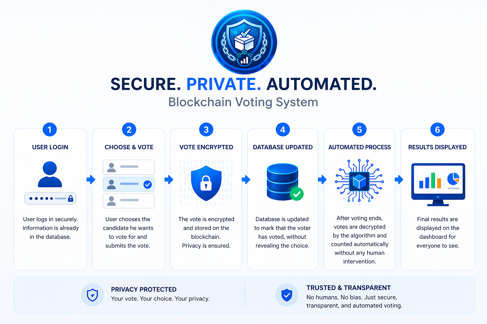

# Encrypted Voting System

This project is a secure, end-to-end encrypted voting platform. It uses a FastAPI backend with MongoDB and a React (Vite) frontend.

## ✅ What has been done

### 🔧 Backend (FastAPI)
- **Complete API Implementation**: All required endpoints for authentication, voting, and administration are fully functional.
- **Security & Encryption**: 
  - Implemented 2048-bit **RSA-OAEP** encryption for votes.
  - Secure **JWT-based authentication** with role-based access control (Admin/Voter).
  - Password hashing using **bcrypt**.
  - Anonymous voting logic using **SHA-256 hashes** for voter IDs in the vote records.
- **Database Architecture**: 
  - Async MongoDB integration using `motor`.
  - Structured collections for `voters`, `candidates`, `votes`, `election_keys`, and `results`.
- **Infrastructure**:
  - Comprehensive `seed.py` script to initialize the database with dummy data and generate fresh RSA keys.
  - Production-ready folder structure and environment configuration.
  - Detailed [server README](server/README.md) for backend-specific setup.

## ⏳ What is left

### 💻 Frontend (React)
- **UI Implementation**: The `client/` folder currently contains a boilerplate Vite + React setup.
- **Authentication Flow**: Integration with `/api/auth/login` to manage JWT tokens and user sessions.
- **Voting Interface**:
  - Dashboard to view candidates via `/api/candidates`.
  - Secure submission of votes to `/api/vote`.
- **Admin Dashboard**:
  - Interface for admins to close elections via `/api/admin/close-election`.
  - Real-time display of final results from `/api/results`.
- **State Management**: Handling authentication state, voting status, and election progress across the application.

### 🧪 Overall
- **Integration Testing**: End-to-end testing between the React frontend and FastAPI backend.
- **Deployment**: Configuring the system for production deployment (e.g., Dockerization, Nginx setup).

## 🚀 Getting Started

### Backend
1. Navigate to `server/`.
2. Follow the setup instructions in [server/README.md](server/README.md).

### Frontend
1. Navigate to `client/`.
2. Run `npm install` and `npm run dev`.
3. *Note: Frontend API integration is still in progress.*
